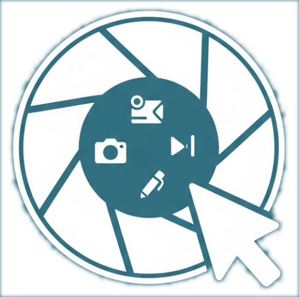

# ClipShot

<p align="center">
  
</p>

A lightweight macOS screenshot, screen recording, and scroll capture utility with built-in annotation tools. Runs as a menu bar app with global hotkeys.

## Features

- **Screenshot capture** with region selection and in-place annotation
- **Screen recording** to H.264 MP4 with a post-recording frame-by-frame editor
- **Scroll capture** that auto-stitches scrolling content into a single tall image
- **Annotation tools**: arrow, rectangle, ellipse, pencil, text, highlight, blur, numbered steps, crop
- **Multi-monitor support** — captures from the display containing the cursor
- **Clipboard integration** — confirm a screenshot to copy it instantly

## Requirements

- macOS (uses native AppKit, Core Graphics, AVFoundation)
- Rust (edition 2024)
- Screen Recording permission (macOS will prompt on first use)

## Build & Run

```bash
cargo build --release
./target/release/clipshot
```

The app appears as a camera icon in the menu bar with no Dock icon.

## Global Hotkeys

| Hotkey | Action |
|---|---|
| Ctrl+Cmd+A | Capture screenshot |
| Ctrl+Cmd+V | Start/stop screen recording |
| Ctrl+Cmd+S | Scroll capture |

## Workflow

### Screenshot

1. **Ctrl+Cmd+A** — overlay appears over the full screen
2. Click and drag to select a region
3. Annotate the selection using the toolbar
4. **Confirm** (checkmark) to copy to clipboard, or **Save** to export as PNG

### Screen Recording

1. **Ctrl+Cmd+V** — overlay appears for region selection
2. Draw the recording area — recording starts immediately
3. A red border outlines the captured region (click-through)
4. **Ctrl+Cmd+V** again or **Stop Recording** from the menu bar to finish
5. The editor opens with the recorded video for annotation and export

### Scroll Capture

1. **Ctrl+Cmd+S** — overlay appears for region selection
2. Draw a region over scrollable content — capture starts automatically
3. Stop scrolling and capturing by **Ctrl+Cmd+S** again
4. Frames are stitched into a single tall image
5. The editor opens for annotation and export as PNG

## Annotation Tools

| Tool | Key | Description |
|---|---|---|
| Select | S | Select, move, and resize existing annotations |
| Arrow | A | Draw arrows |
| Rectangle | R | Draw rectangles |
| Ellipse | E | Draw ellipses |
| Pencil | P | Freehand drawing |
| Text | T | Place text labels |
| Highlight | H | Semi-transparent highlight box |
| Step | N | Auto-numbered step circles |
| Blur | B | Pixelate a region |
| Crop | C | Crop the image or video |

### Stroke Width

| Key | Width |
|---|---|
| 1 | Thin |
| 2 | Medium (default) |
| 3 | Thick |

### Other Shortcuts

| Shortcut | Action |
|---|---|
| Space | Play / Pause (editor) |
| Esc | Cancel / close |
| Delete | Delete selected annotation |
| Cmd+Z | Undo |
| Cmd+Shift+Z | Redo |

## Editor

The editor opens automatically after a screen recording or scroll capture. For recordings it provides:

- Timeline slider for frame-by-frame scrubbing
- Forward and reverse playback
- All annotation tools — annotations can span a range of frames
- Export with annotations composited into the video, or save the raw recording

## Export Formats

| Content | Format |
|---|---|
| Screenshot | PNG (clipboard or file) |
| Scroll capture | PNG |
| Screen recording | MP4 (H.264, 30 fps) |
